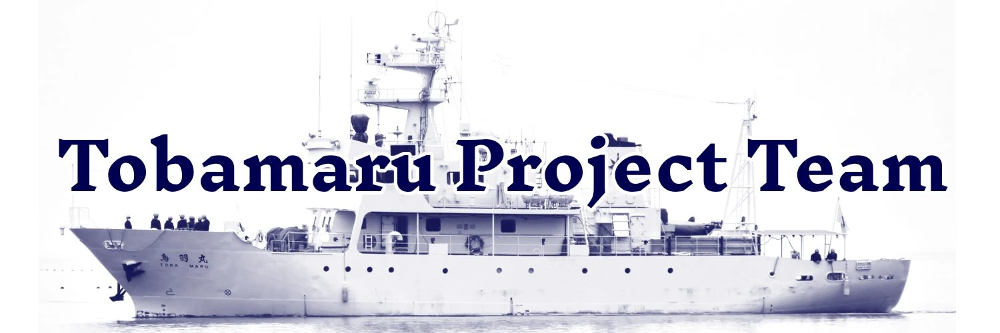

# Tobamaru Project Team ウェブサイト

鳥羽商船高等専門学校 Tobamaru Project Teamのウェブサイトです。

Tobamaru Project
Teamは、代船入替えに向けて記念行事、在校生や卒業生の鳥羽商船に対する愛着や地域の人々の親しみをより深めるための企画を検討する学生団体です。

## サイト

[3rd-tobamaru-lastyear.vercel.app](https://3rd-tobamaru-lastyear.vercel.app/)

## ライセンス

staticフォルダーを除き [CC BY 4.0](./LICENSE)

他サービスのアイコン、ロゴ等はそれらのライセンスを適応

## 制作者

[Takara Hamaguchi](https://github.com/takara2314) をはじめとした
[Tobamaru Project Team](https://3rd-tobamaru-lastyear.vercel.app/)

## 前提環境

- Node.js v18+

<small>
© 2023 Tobamaru Project Team
</small>

